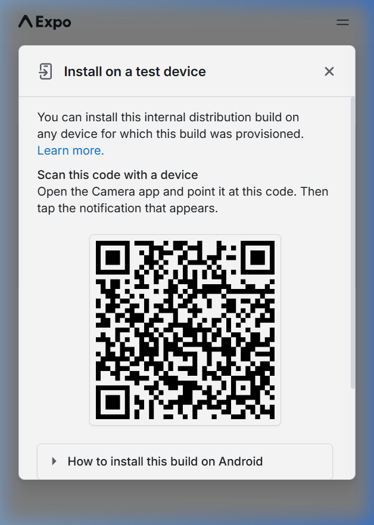

# Nokta Projem - 231118071 Sudenur Yazıcı

Bu proje, Nokta Solo Seferi (Misyon Süresi: 2 Saat) kapsamında geliştirilmiştir.

**Seçilen Track:** Track A — Dot Capture & Enrich

---

## 📱 Expo QR
> [!NOTE]
> Proje canlı build sürümüne aşağıdaki QR kodu okutarak ulaşabilirsiniz:
>
> 

---

## 🎥 Demo Video
> [!IMPORTANT]
> [Buraya 60 saniyelik demo video linkini ekleyiniz]

---

## 📦 APK
> [!TIP]
> **app-release.apk** dosyası bu klasörün kök dizinine eklenmiştir. 
> 
> *Not: Build sayfasına [buradan](https://expo.dev/accounts/sudey/projects/nokta-v1-sudey/builds/89622f23-bd3b-4859-8755-c05ca0785f80) da ulaşılabilir.*

---

## 📓 Decision Log

### 2026-04-17 11:51
- **Proje Başlatma:** Klasör yapısı oluşturuldu.
- **Dokümantasyon:** `idea.md` (Track A içeriği ile) ve `README.md` hazırlandı.
- **App Setup:** Expo Router + TypeScript altyapısı kuruldu.

### 2026-04-17 12:12
- **UI Geliştirme:** Ana sayfa Glassmorphism tasarımına uygun hale getirildi.
- **Dark Theme:** History ve Modal sayfaları koyu tema ile güncellendi.

### 2026-04-17 12:30
- **Fonksiyonel Derinlik:** "Noktayı Olgunlaştır" butonu için çok adımlı (wizard) mühendislik diyalog akışı kuruldu.
- **Dinamik Skorlama:** Metin uzunluğu ve teknik kısıt analizine dayalı dinamik "Trust Index" puanlama sistemi eklendi.

### 2026-04-17 13:40
- **Build & Teslimat:** EAS Build süreci tamamlandı.
- **APK Entegrasyonu:** `app-release.apk` dosyası indirildi ve teslimat klasörüne dahil edildi.
- **Final:** README dokümantasyonu hoca kriterlerine göre son haline getirildi.

---

### Proje Yapısı
- `idea.md`: Track A spesifik mühendislik fikir dosyası.
- `app/`: Expo uygulama kaynak kodları.
- `app-release.apk`: İmzalı Android uygulama dosyası.
- `README.md`: Teslimat detayları ve karar günlüğü.
